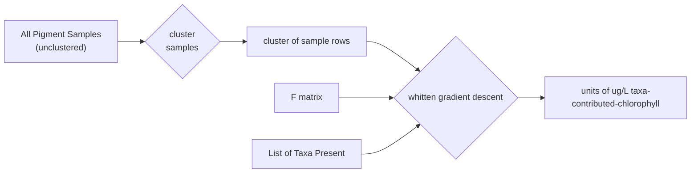

A diagram of how data flows between files

```mermaid
graph LR

%% inputs
samples_unclustered["All Pigment Samples \n(unclustered)"]
--> cluster{cluster \n samples}
--> samples[cluster of sample rows]

f_matrix[F matrix]
taxa_list[List of Taxa Present]

grad_descent{whitten gradient descent}

samples --> grad_descent
f_matrix --> grad_descent
taxa_list --> grad_descent

%% outputs
grad_descent -->
  percent_taxa[units of ug/L taxa-contributed-chlorophyll]
```
